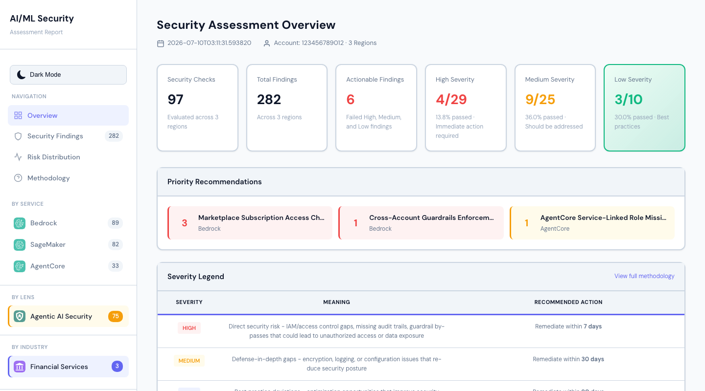
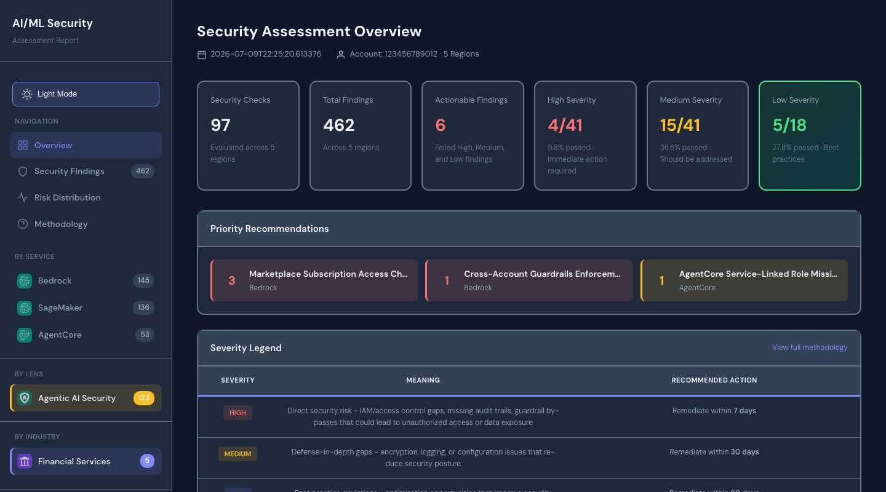
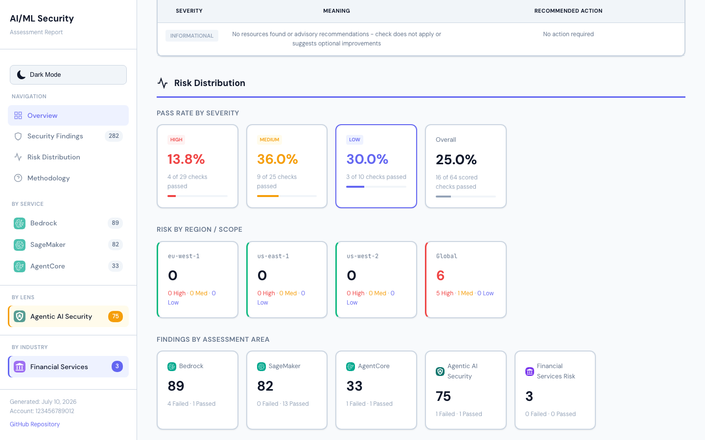

# AWS AI/ML Security Assessment — Amazon Bedrock, Amazon SageMaker AI & Amazon Bedrock AgentCore

   

**Open-source automated security scanner for Amazon Bedrock, Amazon SageMaker AI, and Amazon Bedrock AgentCore** — Built on [AWS Well-Architected Framework (Generative AI Lens)](https://docs.aws.amazon.com/wellarchitected/latest/generative-ai-lens/generative-ai-lens.html)

Cloud security automation with **[52 security checks](docs/SECURITY_CHECKS.md)** for your generative AI and machine learning workloads. Identify IAM misconfigurations, encryption gaps, network isolation issues, and compliance violations with interactive HTML reports and actionable remediation guidance.

---

## See It In Action

The framework generates professional, interactive security assessment reports with filtering, search, and dark mode support.

**Download Sample Reports** | [Single Account](https://aws-samples.github.io/sample-aiml-security-assessment/sample-reports/security_assessment_single_account.html) | [Multi-Account](https://aws-samples.github.io/sample-aiml-security-assessment/sample-reports/security_assessment_multi_account.html)

<table>
  <tr>
    <td width="50%">
      
      
<em>Executive Dashboard (Light Mode)</em>

    </td>
    <td width="50%">
      
      
<em>Executive Dashboard (Dark Mode)</em>

    </td>
  </tr>
  <tr>
    <td colspan="2">
      
      
<em>Interactive Findings Table with Filtering</em>

    </td>
  </tr>
</table>

### Key Features

- **[52 Security Checks](docs/SECURITY_CHECKS.md)** across Amazon Bedrock, Amazon SageMaker AI, and Amazon Bedrock AgentCore
- **Multi-Region Support** — parallel scanning across AWS regions with per-region risk breakdown
- **Multi-Account Support** — consolidated reporting across AWS Organizations
- **Interactive Filtering** by account, region, service, severity, and status
- **Light/Dark Mode** with persistent user preference
- **Fully Automated** — one-click CloudFormation deployment and execution

**Services Covered:**
- **[Amazon Bedrock](docs/SECURITY_CHECKS.md#amazon-bedrock-security-checks-14)** (14 checks) — Guardrails, encryption, VPC endpoints, IAM, model invocation logging
- **[Amazon SageMaker AI](docs/SECURITY_CHECKS.md#amazon-sagemaker-ai-security-checks-25)** (25 checks) — Security Hub controls, encryption, network isolation, IAM, MLOps
- **[Amazon Bedrock AgentCore](docs/SECURITY_CHECKS.md#amazon-bedrock-agentcore-security-checks-13)** (13 checks) — VPC configuration, encryption, observability, resource policies

---

## Quick Start

- **Single-Account**: Jump to [Single-Account Deployment](#single-account-deployment)
- **Multi-Account**: Jump to [Multi-Account Deployment](#multi-account-deployment)

## Architecture

## Prerequisites

- Python 3.12+ — [Install Python](https://www.python.org/downloads/)
- AWS SAM CLI — [Install the AWS SAM CLI](https://docs.aws.amazon.com/serverless-application-model/latest/developerguide/serverless-sam-cli-install.html)
- Docker (optional) — [Install Docker](https://hub.docker.com/search/?type=edition&offering=community) — Only required for local development

---

## Single-Account Deployment

1. Download the [aiml-security-single-account.yaml](deployment/aiml-security-single-account.yaml) CloudFormation template.
2. **[Deploy to AWS CloudFormation](https://console.aws.amazon.com/cloudformation/home#/stacks/create/template?stackName=aiml-security-single-account)**
3. Upload the template and provide a stack name.
4. Optionally specify your email address to receive notifications.
5. **(Optional) Multi-Region**: Set `TargetRegions` to scan multiple regions:
   - Leave empty to scan only the deployment region (default)
   - Comma-separated list (for example, `us-east-1,us-west-2,eu-west-1`)
   - `all` to scan all regions where the services are available
6. Acknowledge IAM capabilities and click **Submit**.
7. Once complete, CodeBuild automatically runs the assessment.
8. View results: go to the stack **Outputs** tab → copy `AssessmentBucket` → open the report under the `/{account_id}/` prefix in that S3 bucket.

> **Tip**: The deployment creates two stacks. Your results are in the stack *you named*, not the auto-generated `aiml-sec-*` stack. See [Troubleshooting](docs/TROUBLESHOOTING.md#8-confused-by-multiple-cloudformation-stacks) for details.

---

## Multi-Account Deployment

### Step 1: Deploy Member Roles

Deploy [1-aiml-security-member-roles.yaml](deployment/1-aiml-security-member-roles.yaml) to all target accounts using CloudFormation StackSets with service-managed permissions.

1. Navigate to **CloudFormation** > **StackSets** in the management account
2. Upload the template and set `ManagementAccountID` to your management account
3. Select **Service-managed permissions** and target your OUs
4. Select your target region and submit

### Step 2: Deploy Central Infrastructure

Deploy [2-aiml-security-codebuild.yaml](deployment/2-aiml-security-codebuild.yaml) in your management account.

1. Upload the template and set `MultiAccountScan` to `true`
2. Optionally set `TargetRegions` for multi-region scanning
3. Optionally provide an email address for notifications
4. Acknowledge IAM capabilities and submit
5. Stack creation automatically triggers the assessment across all accounts

---

## Multi-Region Scanning

Both deployment modes support scanning multiple AWS regions in parallel via the `TargetRegions` parameter:

| Value | Behavior |
|-------|----------|
| Empty (default) | Scans deployment region only — fully backward compatible |
| Comma-separated (for example, `us-east-1,us-west-2`) | Scans those regions in parallel |
| `all` | Discovers and scans all regions where assessed services are available |

Scanning uses a Step Functions Map state, so multiple regions execute in parallel with no additional time cost. Services unavailable in a region produce an informational N/A finding.

The HTML report includes a Region column, filter dropdown, and "Risk by Region" summary.

> **Upgrading an existing deployment?** See [Troubleshooting](docs/TROUBLESHOOTING.md#9-upgrading-an-existing-deployment-to-multi-region) — it's a simple stack parameter update with no teardown.

---

## How It Works

1. **Deploy** — CloudFormation creates CodeBuild, S3, IAM roles, and a Lambda trigger
2. **CodeBuild runs** — builds and deploys the SAM assessment stack (per account in multi-account mode)
3. **Step Functions execute** — orchestrates: S3 cleanup → IAM permission caching → resolve regions → Map state fans out per-region assessments (Bedrock, SageMaker, AgentCore in parallel) → generate consolidated report
4. **Results** — HTML and CSV reports are stored in your S3 bucket

For detailed architecture, execution flow, and extension guidance, see the [Developer Guide](docs/DEVELOPER_GUIDE.md).

---

## Viewing Results

1. Open your **infrastructure stack** in CloudFormation → **Outputs** tab → copy `AssessmentBucket`
2. Navigate to that S3 bucket
3. For single-account, open `{account_id}/security_assessment_single_account_*.html`
4. For multi-account, open `consolidated-reports/security_assessment_multi_account_*.html`

### Understanding Results

| Severity | Meaning |
|----------|---------|
| **High** | Critical — immediate action required |
| **Medium** | Important — should be addressed |
| **Low** | Minor — best practice optimization |
| **Informational** | Advisory — no action required |

| Status | Meaning |
|--------|---------|
| **Failed** | Security issue identified |
| **Passed** | Resource meets best practice |
| **N/A** | No resources to assess or service not available in region |

---

## Customization

| Task | How |
|------|-----|
| Add new accounts | Add to StackSet deployment targets |
| Modify permissions scope | Edit `1-aiml-security-member-roles.yaml` |
| Adjust concurrency | Change `ConcurrentAccountScans` parameter |
| Add new service checks | See [Developer Guide](docs/DEVELOPER_GUIDE.md#adding-new-aiml-service-assessments) |

---

## Permissions Required

The deployment uses multiple IAM roles with different trust and permission boundaries. They are not all read-only.

- **`CodeBuildRole` / `MultiAccountCodeBuildRole`**: orchestration roles used by the infrastructure stack to clone the repo, build SAM, deploy/update the assessment stack, and start Step Functions executions. These roles require infrastructure-management permissions such as CloudFormation, Lambda, IAM, Step Functions, and S3 actions.
- **`AIMLSecurityMemberRole`**: role assumed in the target account during single-account and multi-account runs. In the multi-account flow this role is also **not read-only**. It needs both service-read permissions for the checks and deployment permissions so CodeBuild can create or update the per-account SAM assessment stack.
- **SAM-created Lambda execution roles**: runtime roles for the assessment functions. These are the closest thing to read-only assessment roles. They primarily use `List*`, `Describe*`, and `Get*` access against Bedrock, SageMaker, AgentCore, IAM analysis APIs, and supporting read APIs, plus S3 access to write reports and read the cached IAM permissions file.

If you need to reduce scope, review the role policies in:

- [deployment/aiml-security-single-account.yaml](/Users/akothurk/Documents/Code/Github/aws-samples/sample-aiml-security-assessment/deployment/aiml-security-single-account.yaml)
- [deployment/1-aiml-security-member-roles.yaml](/Users/akothurk/Documents/Code/Github/aws-samples/sample-aiml-security-assessment/deployment/1-aiml-security-member-roles.yaml)
- [deployment/2-aiml-security-codebuild.yaml](/Users/akothurk/Documents/Code/Github/aws-samples/sample-aiml-security-assessment/deployment/2-aiml-security-codebuild.yaml)
- [aiml-security-assessment/template.yaml](/Users/akothurk/Documents/Code/Github/aws-samples/sample-aiml-security-assessment/aiml-security-assessment/template.yaml)
- [aiml-security-assessment/template-multi-account.yaml](/Users/akothurk/Documents/Code/Github/aws-samples/sample-aiml-security-assessment/aiml-security-assessment/template-multi-account.yaml)

---

## Documentation

| Document | Description |
|----------|-------------|
| [Security Checks Reference](docs/SECURITY_CHECKS.md) | Complete reference for all 52 security checks |
| [Troubleshooting Guide](docs/TROUBLESHOOTING.md) | Common issues, stack identification, upgrade guide, debugging |
| [Developer Guide](docs/DEVELOPER_GUIDE.md) | Architecture details, adding custom checks, contributing |
| [Cleanup Guide](docs/CLEANUP.md) | Step-by-step resource removal instructions |

---

## CI/CD

GitHub Actions workflows run automatically on pull requests and pushes to `main`:

| Workflow | Trigger | What It Checks |
|----------|---------|----------------|
| **Python Code Quality** | PR | `ruff check` and `ruff format --check` on changed Python files |
| **CloudFormation Lint** | PR | Validates deployment and SAM templates with `cfn-lint` |
| **SAM Validate & Build** | PR | `sam validate --lint` and `sam build` on SAM templates |
| **ASH Security Scan** | PR | Scans for secrets, dependency vulnerabilities, and IaC misconfigurations |
| **ASH Full Repository Scan** | Push to main, monthly | Full repository security scan |

---

## Contributing

We welcome community contributions! See the [Developer Guide](docs/DEVELOPER_GUIDE.md) for guidelines.

## Security

See [CONTRIBUTING](CONTRIBUTING.md#security-issue-notifications) for reporting security issues.

## License

This library is licensed under the MIT-0 License. See the [LICENSE](LICENSE) file.
