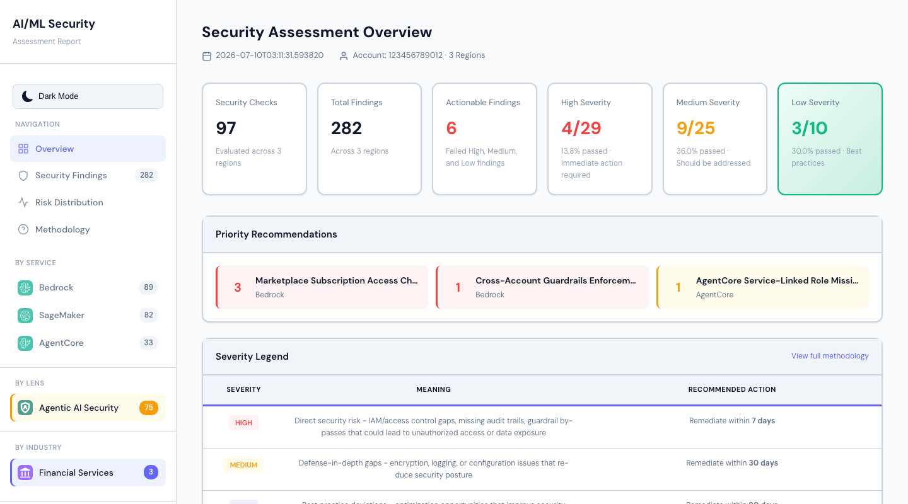
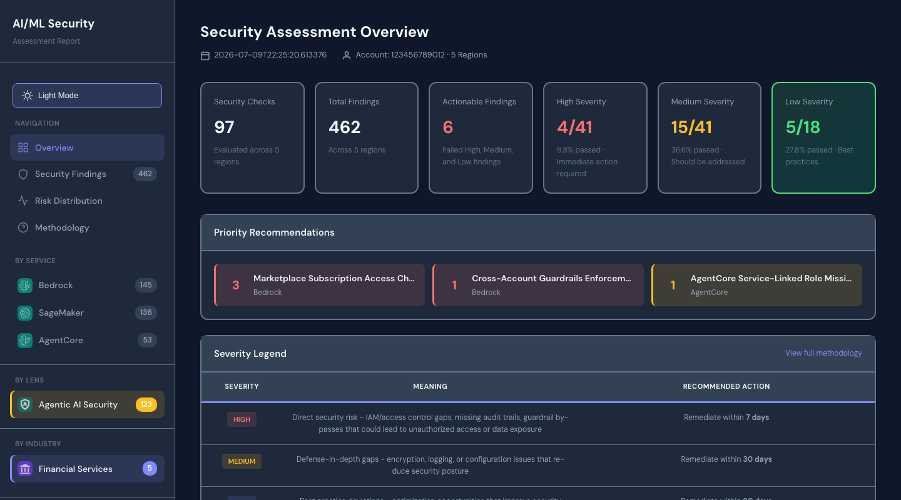
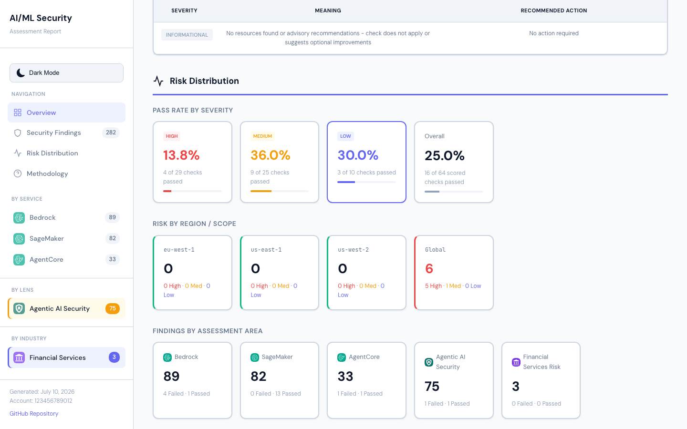

# AWS AI/ML Security Assessment for Amazon Bedrock, Amazon SageMaker AI, Amazon Bedrock AgentCore, and AWS Agent Registry

*A serverless framework that scans your AWS accounts for AI/ML security misconfigurations and produces an interactive, shareable report.*

[](https://opensource.org/licenses/MIT-0) [](https://www.python.org/downloads/) [](https://aws.amazon.com/serverless/sam/)

**Open-source automated security scanner for generative AI and machine learning workloads on AWS.** It brings together separate assessments for Amazon Bedrock, Amazon SageMaker AI, Amazon Bedrock AgentCore, and AWS Agent Registry. Core checks are guided by the [AWS Well-Architected Generative AI Lens](https://docs.aws.amazon.com/wellarchitected/latest/generative-ai-lens/generative-ai-lens.html). The optional **Responsible AI GRC** module adds technical checks for AI governance, risk, and compliance, drawing on the [AWS User Guide to Governance, Risk, and Compliance for Responsible AI Adoption](https://d1.awsstatic.com/whitepapers/compliance/AWS-User-Guide-Governance-Risk-Compliance-for-Responsible-AI-Adoption-Financial-Services.pdf). Optional **OWASP Top 10 for LLM** checks extend coverage across common LLM security risks.

Run **[208 checks](docs/SECURITY_CHECKS.md)** across AWS accounts and regions:

- **94 core checks** for Amazon Bedrock, Amazon SageMaker AI, Amazon Bedrock AgentCore, and AWS Agent Registry; each service can be [selected individually](#selecting-service-assessments) and all four run by default
- **Up to 38 Agentic AI Security checks**, synthesized from service findings and native AgentCore gateway checks
- **64 optional Responsible AI GRC checks** for selected technical controls informed by AWS governance, risk, and compliance guidance
- **12 optional OWASP Top 10 for LLM checks**, including mapping-based coverage and native system-prompt-leakage checks

Deploy in a single account or across AWS Organizations. Assessments support
multi-region execution within the standard AWS commercial partition and
produce interactive reports with severity ratings, filtering, search,
remediation references, and per-account and per-region views. Assessment
artifacts are stored in your AWS account; the deployment build pulls source
from the configured repository.

> **Scope note:** Responsible AI GRC provides selected AWS configuration checks for AI governance, risk, and compliance. It complements architectural reviews such as the AWS Well-Architected Responsible AI Lens and broader compliance programs. See [Responsible AI GRC scope, sources, and compatibility](docs/RESPONSIBLE_AI_GRC_SCOPE.md).

---

## See It In Action

The framework generates interactive security assessment reports with filtering, search, and dark mode support.

**Sample reports:** [Single Account](https://aws-samples.github.io/sample-aiml-security-assessment/sample-reports/security_assessment_single_account.html) | [Multi-Account](https://aws-samples.github.io/sample-aiml-security-assessment/sample-reports/security_assessment_multi_account.html)

<table>
  <tr>
    <td width="50%">
      
      <p align="center"><em>Executive Dashboard (Light Mode)</em></p>
    </td>
    <td width="50%">
      
      <p align="center"><em>Executive Dashboard (Dark Mode)</em></p>
    </td>
  </tr>
  <tr>
    <td colspan="2">
      
      <p align="center"><em>Interactive Findings Table with Filtering</em></p>
    </td>
  </tr>
</table>

### Key Features

- **Executive Summary** with severity counts and service breakdown
- **Priority Recommendations** highlighting critical issues that need immediate attention
- **Service, lens, and compliance views** for Amazon Bedrock, Amazon SageMaker AI, Amazon Bedrock AgentCore, AWS Agent Registry, Agentic AI Security, Responsible AI GRC, and OWASP Top 10 for LLM
- **Multi-Region Support** within the standard AWS commercial partition, with a per-region risk breakdown
- **Interactive Filtering** by account, region, service, severity, and status, plus real-time text search
- **Light/Dark Mode Toggle** with a persistent preference
- **Direct AWS Documentation Links** with remediation guidance for each finding
- **Multi-Account Support** with consolidated reporting across your organization
- **[Changes Since Last Assessment](docs/ASSESSMENT_HISTORY.md)** after every run: what was resolved, regressed, is new, or no longer appears since the account's previous run
- **Fully Automated** deployment and execution through AWS CloudFormation and AWS CodeBuild

---

## Table of Contents

- [What It Does](#what-it-does)
- [Scope and Limitations](#scope-and-limitations)
- [Architecture](#architecture)
- [Prerequisites](#prerequisites)
- [Single-Account Deployment](#single-account-deployment)
- [Multi-Account Deployment](#multi-account-deployment)
- [Configuration](#configuration)
  - [Selecting Service Assessments](#selecting-service-assessments)
  - [Optional: Responsible AI GRC Checks](#optional-responsible-ai-grc-checks-enableresponsibleaigrcassessment)
  - [Optional: OWASP Top 10 for LLM Checks](#optional-owasp-top-10-for-llm-checks-enableowaspassessment)
  - [Changes Since Last Assessment](#changes-since-last-assessment-enableassessmenthistory)
  - [Multi-Region Scanning](#multi-region-scanning)
  - [Optional Security Policy Baselines](#optional-security-policy-baselines)
- [Upgrading an Existing Deployment](#upgrading-an-existing-deployment)
- [How It Works](#how-it-works)
- [Viewing Results](#viewing-results)
- [Customization](#customization)
- [Permissions Required](#permissions-required)
- [Documentation](#documentation)
- [Contributing](#contributing)
- [Security](#security)
- [License](#license)

---

<a id="why-use-this-framework"></a>

## What It Does

This serverless assessment framework evaluates your AI/ML workloads against AWS security best practices. It gathers configuration data from the AWS control plane and generates reports with the status, severity, and recommended action for each security check. All processing and report storage stay in your AWS account.

| Assessment area | Checks | Controlled by (default) | What it covers |
| --- | --- | --- | --- |
| [Amazon Bedrock](docs/SECURITY_CHECKS.md#amazon-bedrock-security-checks-40) | 40 | `EnableBedrockAssessment` (`true`) | Guardrails, data retention, encryption, VPC endpoints, IAM, agents, logging, monitoring, evaluation, quotas |
| [Amazon SageMaker AI](docs/SECURITY_CHECKS.md#amazon-sagemaker-ai-security-checks-29) | 29 | `EnableSageMakerAssessment` (`true`) | Network exposure, encryption, isolation, GuardDuty, HyperPod, Model Registry, MLOps, monitoring |
| [Amazon Bedrock AgentCore](docs/SECURITY_CHECKS.md#amazon-bedrock-agentcore-security-checks-17) | 17 | `EnableAgentCoreAssessment` (`true`) | Runtime and tool isolation, encryption, identity, observability, policies, online evaluation |
| [AWS Agent Registry](docs/SECURITY_CHECKS.md#aws-agent-registry-security-checks-8) | 8 | `EnableAgentRegistryAssessment` (`true`) | Registry IAM access, approval, discovery authorization, encryption, lifecycle, provenance |
| [Agentic AI Security](docs/SECURITY_CHECKS.md#agentic-ai-security-checks-38) | Up to 38 | Derived from the selected Bedrock, AgentCore, and Agent Registry assessments | The [Agentic AI Lens](https://docs.aws.amazon.com/wellarchitected/latest/agentic-ai-lens/agentic-ai-lens.html) view of selected Bedrock, AgentCore, and Agent Registry findings, plus native AgentCore gateway checks |
| [Responsible AI GRC](docs/SECURITY_CHECKS.md#responsible-ai-grc-checks-64-additional-5-upstream-extensions) | 64 | `EnableResponsibleAIGRCAssessment` (`false`) | AI governance, risk, and compliance controls such as content safety, excessive agency, supply chain, and PII disclosure |
| [OWASP Top 10 for LLM](docs/SECURITY_CHECKS.md#owasp-top-10-for-llm-checks-12) | 12 | `EnableOWASPAssessment` (`false`) | [OWASP Top 10 for LLM 2025](https://genai.owasp.org/llm-top-10/) LLM01–LLM10, mapped from existing findings, plus native system-prompt-leakage checks |

<details>
<summary>Detailed coverage by assessment area</summary>

- **Amazon Bedrock** - Guardrails, prompt-attack and image filtering, cross-account policies, data retention, inference profiles, automated reasoning and Marketplace endpoint encryption and networking, Amazon VPC endpoints, IAM permissions, agent guardrails and least privilege, logging, monitoring, evaluation, quotas, and Lambda code scanning.
- **Amazon SageMaker AI** - AWS Security Hub controls, internet and VPC exposure, encryption, isolation, GuardDuty AI Protection, HyperPod, Model Registry resource policies, MLOps, monitoring, approval, drift detection, deployment patterns, and lineage tracking. `SM-29` is reserved for a deferred Unified Studio networking check; `SM-30` is implemented.
- **Amazon Bedrock AgentCore** - Runtime, Code Interpreter, and browser VPC isolation; Identity token-vault encryption; browser recording; memory, policy-engine, and gateway encryption; observability; VPC endpoints; policies; and online evaluation.
- **AWS Agent Registry** - Registry IAM access, publication approval, discovery authorization, encryption, organization auto-detection, record lifecycle, and provenance.
- **Agentic AI Security** - Bounded autonomy, agent identity and access, tool authorization, Registry governance and provenance, guardrail enforcement, prompt and input protection, memory privacy, auditability and continuous assurance, and abuse and cost protection. Rows come only from the selected source assessments.
- **Responsible AI GRC** - Unbounded consumption, excessive agency, supply chain, training data poisoning, vector weaknesses, non-compliant output, misinformation, harmful or biased output, PII disclosure, hallucination, prompt injection, improper output handling, off-topic output, and out-of-date training data.
- **OWASP Top 10 for LLM** - Maps existing Amazon Bedrock, Amazon SageMaker AI, Amazon Bedrock AgentCore, and Responsible AI GRC findings to LLM01–LLM10, and adds two native LLM07 checks for system prompt leakage. AWS Agent Registry findings are intentionally excluded because the current Registry controls do not directly establish an OWASP LLM01–LLM10 control.

</details>

<details>
<summary>Why use this framework?</summary>

| Challenge | How this framework helps |
| --- | --- |
| **Manual security audits are time-consuming** | Fully automated scanning with one-click CloudFormation deployment |
| **Inconsistent security checks across teams** | A standardized assessment based on the AWS Well-Architected Generative AI Lens and Agentic AI Lens, AWS Responsible AI governance, risk, and compliance guidance, and the OWASP Top 10 for LLM |
| **Difficulty tracking AI/ML security posture** | Interactive HTML dashboards with severity breakdowns, per-account visibility, and a report of changes since the previous run |
| **Multi-account complexity** | Consolidated reporting across AWS Organizations with cross-account role assumption |
| **Compliance and audit support** | Exportable reports that supplement your compliance program, with remediation guidance linked to AWS documentation |
| **Generative AI security gaps** | Purpose-built checks for LLM guardrails, model access controls, and prompt injection prevention |

</details>

---

## Scope and Limitations

This tool operates within the [AWS Shared Responsibility Model](https://aws.amazon.com/compliance/shared-responsibility-model/). It assesses **your configuration responsibilities** (IAM policies, encryption settings, network isolation, logging) for AI/ML services. It does not assess AWS-managed infrastructure, physical security, or the underlying service platform.

- **Point-in-time assessment.** Each run captures your security posture at the moment of execution. Run assessments regularly and after significant changes.
- **No guarantee of security or compliance.** The framework identifies common misconfigurations based on AWS best practices and the AWS Well-Architected Framework. It does not cover every possible risk, does not replace formal compliance audits (such as SOC 2 or HIPAA), and does not guarantee that your workloads are secure. Use the results as one input into your broader security program.
- **Services assessed.** Amazon Bedrock, Amazon SageMaker AI, Amazon Bedrock AgentCore, and AWS Agent Registry, plus the derived and optional areas above. Other AI/ML services (such as Amazon Comprehend, Amazon Rekognition, and Amazon Textract) are not currently assessed.
- **AWS partition support.** Deployment and assessment are validated only in the standard AWS commercial partition (`aws`). AWS GovCloud (US) (`aws-us-gov`) and AWS China (`aws-cn`) are not currently validated or supported, even though parts of the codebase handle partition-aware ARNs and region discovery.

---

## Architecture


For the two-phase deployment model, Step Functions workflow, and Lambda functions, see the [Developer Guide](docs/DEVELOPER_GUIDE.md#two-phase-architecture).

## Prerequisites

The standard deployment runs entirely through AWS CloudFormation and AWS CodeBuild, so you need only an AWS account with permission to create the stacks. For local development:

- Python 3.12 — [Install Python](https://www.python.org/downloads/)
- AWS SAM CLI — [Install the AWS SAM CLI](https://docs.aws.amazon.com/serverless-application-model/latest/developerguide/serverless-sam-cli-install.html)
- Docker (optional) — [Install Docker](https://docs.docker.com/get-started/get-docker/) — required only for local Lambda invocation

---

<a id="quick-start"></a>

## Single-Account Deployment

1. Download the [aiml-security-single-account.yaml](deployment/aiml-security-single-account.yaml) CloudFormation template.
2. Open **[Create stack in AWS CloudFormation](https://console.aws.amazon.com/cloudformation/home#/stacks/create/template?stackName=aiml-security-single-account)**.
3. Upload the template and provide a stack name.
4. Optionally, specify an email address to receive notifications.
5. Optionally, set `TargetRegions` to scan [multiple regions](#multi-region-scanning). Leave it empty to scan only the deployment region.
6. Review the [service selection](#selecting-service-assessments) and [optional assessment](#configuration) parameters, and the [security policy baselines](#optional-security-policy-baselines). The Marketplace endpoint CMK baseline is enabled by default.
7. Acknowledge the IAM capabilities and choose **Submit**.
8. When stack creation completes, CodeBuild runs the assessment automatically.
9. [View the results](#viewing-results).

> **Tip**: CodeBuild creates additional stacks: the `aiml-sec-{account_id}` assessment stack and, if it does not already exist, the AWS SAM CLI's `aws-sam-cli-managed-default` artifact stack. Your results are in the stack *you named*, not the auto-generated `aiml-sec-*` stack. See [Troubleshooting](docs/TROUBLESHOOTING.md#11-confused-by-multiple-cloudformation-stacks) for details.

---

## Multi-Account Deployment

### Step 1: Deploy Member Roles

Deploy [1-aiml-security-member-roles.yaml](deployment/1-aiml-security-member-roles.yaml) to all target accounts using CloudFormation StackSets with service-managed permissions.

1. In the AWS Organizations management account or a delegated administrator account, navigate to **CloudFormation** > **StackSets**.
2. Upload the template and set `ManagementAccountID` to the account ID where the central multi-account CodeBuild project runs.
3. Select **Service-managed permissions** and target your organizational units (OUs).
4. Select your target region and submit.

### Step 2: Deploy Central Infrastructure

Deploy [2-aiml-security-codebuild.yaml](deployment/2-aiml-security-codebuild.yaml) in your central assessment account. This can be your AWS Organizations management account or a delegated administrator or central tooling account.

1. Upload the template and set `MultiAccountScan` to `true`.
2. Optionally, set `TargetRegions` for [multi-region scanning](#multi-region-scanning) and provide an email address for notifications.
3. Review the [service selection](#selecting-service-assessments), [optional assessment](#configuration), and [security policy baseline](#optional-security-policy-baselines) parameters. The central values are propagated to every per-account deployment.
4. Acknowledge the IAM capabilities and submit.
5. Stack creation automatically starts the assessment across all accounts.

---

## Configuration

All settings below are CloudFormation parameters on the top-level deployment templates. Changing a value requires a stack update followed by a new CodeBuild run.

### Selecting Service Assessments

Choose which direct service assessments run:

| Parameter | Assessment | Default |
| --- | --- | --- |
| `EnableBedrockAssessment` | Amazon Bedrock | `true` |
| `EnableSageMakerAssessment` | Amazon SageMaker AI | `true` |
| `EnableAgentCoreAssessment` | Amazon Bedrock AgentCore | `true` |
| `EnableAgentRegistryAssessment` | AWS Agent Registry | `true` |

For a Bedrock-only run, leave `EnableBedrockAssessment=true` and set the other
three parameters to `false`. Existing deployments keep all four services
enabled unless you change these parameters.

- **Deselected services are labeled Not selected.** Their Lambda functions are not invoked and produce no CSV files. The report labels their areas **Not selected** rather than showing an assessed service with zero findings. Selecting no direct services is supported and produces a scope-only report.
- **Derived views shrink with the selection.** The Agentic AI lens contains only rows from the selected Bedrock, AgentCore, and Agent Registry assessments. OWASP controls that lose a source show an N/A/Informational coverage notice; a control that loses its only source (such as OW-07 when Bedrock is off) remains visible as unassessed.
- **Optional assessments stay independent.** Responsible AI GRC still assesses deselected services when it is enabled, including when it runs as an OWASP dependency. To limit execution to the selected services, disable both `EnableResponsibleAIGRCAssessment` and `EnableOWASPAssessment`.
- **Compare like with like.** Deselecting a well-configured service can lower the pass rate by removing passing controls from the score. Compare pass rates only across runs with the same selection.

Selection controls execution, not provisioning: the Lambda functions and their
IAM roles remain deployed. The selection is read from the stack parameters at
the start of each execution and cannot be overridden through `StartExecution`
input. For implementation details, see the
[Developer Guide](docs/DEVELOPER_GUIDE.md#service-selection).

<a id="how-finding-severities-are-determined"></a>

### Optional: Responsible AI GRC Checks (`EnableResponsibleAIGRCAssessment`)

The 64 Responsible AI GRC (`FS-XX`) checks are **opt-in** (default `false`).
Set `EnableResponsibleAIGRCAssessment` to `true` to run them; findings appear in
a dedicated **Responsible AI GRC** section of the report. The assessment runs
once per account, not once per region. The legacy `EnableFinServAssessment`
parameter is still accepted as an alias; see
[Migrating from EnableFinServAssessment](docs/RESPONSIBLE_AI_GRC_SCOPE.md#migrating-from-enablefinservassessment).

Severities follow a documented Impact × Likelihood methodology aligned with the
AWS Security Hub severity scale; see the
[Responsible AI GRC Severity Methodology](docs/SECURITY_CHECKS_RESPONSIBLE_AI_GRC_SEVERITY_METHODOLOGY.md).
Compliance mappings are preliminary; validate them with your risk, legal, and
compliance teams before relying on them as audit evidence.

> **Direct SAM deployments:** If you deploy `aiml-security-assessment/template.yaml` yourself and start executions manually, include `"enableResponsibleAIGRC": "true"` in the `StartExecution` input to run these checks.

<a id="scope-and-limitations-1"></a>

### Optional: OWASP Top 10 for LLM Checks (`EnableOWASPAssessment`)

The 12 OWASP Top 10 for LLM (`OW-XX`) checks are **opt-in** (default `false`).
Set `EnableOWASPAssessment` to `true` to run them. The OWASP assessment maps
existing Bedrock, SageMaker AI, AgentCore, and Responsible AI GRC findings to
LLM01–LLM10 and runs two native checks for LLM07 (System Prompt Leakage).
Findings appear in the report's **By Compliance Standard** section.

Many OWASP mappings derive from Responsible AI GRC checks, so enabling OWASP
also runs the Responsible AI GRC assessment. Unless you enable Responsible AI
GRC explicitly, those findings are used only as OWASP evidence: they are hidden
from the report, and their CSV is not copied to the report bucket. See
[OWASP Top 10 for LLM Checks](docs/SECURITY_CHECKS_OWASP.md) for the mappings and
status semantics.

### Changes Since Last Assessment (`EnableAssessmentHistory`)

After each run, the framework compares each account's findings with that
account's previous usable run and writes
`security_assessment_changes_<timestamp>.html` and `.csv` next to the run's
main report. Each finding is labeled Resolved, Still open, Regressed, New, No
longer reported, or No longer assessed. This is **on by default**; set
`EnableAssessmentHistory` to `false` to turn it off. The first run of an
account has nothing to compare with and is skipped. The comparison reads only
the findings CSVs already in the bucket (plus, in single-account mode, a small
run record written there) and cannot fail an assessment run. See
[Changes Since Last Assessment](docs/ASSESSMENT_HISTORY.md).

### Multi-Region Scanning

Both deployment modes can scan multiple AWS regions in parallel through the `TargetRegions` parameter:

| Value | Behavior |
| --- | --- |
| Empty (default) | Scans the deployment region only |
| Comma- or space-separated list (for example, `us-east-1,us-west-2` or `us-east-1 us-west-2`) | Scans those regions in parallel |

Regions are scanned by a Step Functions Map state, up to five at a time by
default (`MaxRegionConcurrency` in the SAM templates; the top-level deployment
templates do not expose it, so CodeBuild deployments always use `5`). Services unavailable in
a region produce an informational N/A finding. Responsible AI GRC runs once per
account rather than per region. The report includes a Region column, a region
filter, and a "Direct Failed Rows by Region / Scope" summary.

`TargetRegions` selects regions within the commercial partition only; it does
not add support for AWS GovCloud (US) or China regions. To add regions to an
existing deployment, see
[Changing an Existing Deployment to Multi-Region](docs/UPGRADING.md#changing-an-existing-deployment-to-multi-region).

### Optional Security Policy Baselines

Some checks cannot infer your intended trust or hardening policy, so the
deployment templates expose organization-specific baselines. Defaults keep
these checks advisory, except Marketplace endpoint customer-managed encryption
(`RequireMarketplaceEndpointCMK`), which is enforced by default.

<details>
<summary>Baseline parameters</summary>

| CloudFormation parameter | Default | Affected check | Behavior |
| --- | --- | --- | --- |
| `RequireBedrockZeroDataRetention` | `false` | BR-37 | When `true`, the Bedrock account retention modes `default` and `inherit` fail the explicit zero-data-retention baseline. `provider_data_share` fails regardless of this setting. |
| `RequireMarketplaceEndpointCMK` | `true` | BR-40 | When `true`, a Bedrock Marketplace model endpoint without a customer-managed KMS key fails. BR-40 uses `kms:DescribeKey` and requires `KeyManager=CUSTOMER`; AWS-managed keys do not pass. When `false`, a missing or AWS-managed key is reported as an informational `N/A` hardening advisory. |
| `RequireAgentCoreOnlineEvaluation` | `false` | AC-17 | When `true`, missing or incomplete active AgentCore online evaluation coverage fails. When `false`, absent coverage is informational. |
| `RequireAgentRegistryManualApproval` | `false` | AR-03 | When `true`, Agent Registry instances configured to approve all submitted records fail. When `false`, automatic approval is reported as an informational governance advisory. |
| `RequireAgentRegistryCMK` | `false` | AR-05 | When `true`, registries using the default AWS owned encryption key fail. When `false`, AWS owned key encryption is reported as an informational hardening advisory; registries with a customer-managed KMS key pass. |
| `AgentCoreTokenVaultId` | `default` | AC-14 | Selects the regional AgentCore Identity token vault whose customer-managed KMS encryption is assessed. |
| `ApprovedExternalAccountIds` | Empty | SM-30 | Comma-separated 12-digit AWS account IDs approved to receive SageMaker Model Registry access. Accounts outside the configured boundary fail. |
| `ApprovedOrganizationIds` | Empty | SM-30 | Comma-separated AWS Organizations IDs approved to receive SageMaker Model Registry access. Organizations outside the configured boundary fail. |

Do not include spaces in the approved-account and approved-organization lists.
If both lists are empty, SM-30 still detects public access, but external
sharing that cannot be compared with an explicit organizational boundary is
reported as `Passed` with Informational severity and a review recommendation.

These parameters are available in both top-level deployment templates and both
direct SAM templates. CodeBuild passes the selected values to every deployed
assessment stack.

</details>

<details>
<summary>Setting comma-separated values with the AWS CLI</summary>

The AWS CLI shorthand syntax uses commas as field separators, so an unescaped
`ParameterValue=111122223333,444455556666` is not treated as one value. Use a
JSON parameter file instead.

Create `params.json`:

```json
[
  {
    "ParameterKey": "ApprovedExternalAccountIds",
    "ParameterValue": "111122223333,444455556666"
  },
  {
    "ParameterKey": "ApprovedOrganizationIds",
    "ParameterValue": "o-a1b2c3d4e5,o-f6g7h8i9j0"
  }
]
```

Then pass the file to the stack update:

```bash
aws cloudformation update-stack \
  --stack-name <stack-name> \
  --use-previous-template \
  --capabilities CAPABILITY_NAMED_IAM \
  --parameters file://params.json
```

`update-stack` resets any parameter omitted from the file to its template
default. To keep a current value, add an entry such as
`{"ParameterKey": "TargetRegions", "UsePreviousValue": true}` for each other
parameter you have changed. The update does not start CodeBuild; start a build
afterward to apply the new values.

</details>

---

<a id="determine-what-changed"></a>
<a id="single-account-upgrade"></a>
<a id="multi-account-upgrade"></a>

## Upgrading an Existing Deployment

Update existing stacks in place; do not delete them. The required steps depend
on which files changed between your deployed revision and the target release:

| Files changed in the target release | Required action |
| --- | --- |
| `aiml-security-assessment/**`, Lambda `requirements.txt`, or `buildspec.yml` | Run CodeBuild so it builds and updates the AWS SAM assessment stack |
| `consolidate_html_reports.py` | Run multi-account CodeBuild |
| `assessment_history/**` | Run CodeBuild (the changes report runs from this package) |
| `deployment/aiml-security-single-account.yaml` | Update the single-account infrastructure stack |
| `deployment/1-aiml-security-member-roles.yaml` | Update every targeted member-role StackSet instance **before** running CodeBuild |
| `deployment/2-aiml-security-codebuild.yaml` | Update the multi-account central infrastructure stack |
| Only documentation, tests, examples, or GitHub workflow files | No update is required |

Check the `Deployment impact` section of [CHANGELOG.md](CHANGELOG.md) first.
Stack updates do not start CodeBuild automatically, so start a build manually
whenever assessment code changed. For the full procedure, including pinned
revisions, verification, and direct SAM deployments, see the
[Upgrade Guide](docs/UPGRADING.md).

---

<a id="multi-account-orchestration"></a>

## How It Works

1. **Deploy** — CloudFormation creates the CodeBuild project, S3 bucket, IAM roles, and a Lambda function that starts the first build.
2. **CodeBuild runs** — it builds and deploys the AWS SAM assessment stack (in each account, in multi-account mode).
3. **Step Functions executes the assessment** — S3 cleanup → IAM permission caching → region resolution → a Map state across regions. In each region, the selected Bedrock, SageMaker AI, AgentCore, and Agent Registry assessments run in parallel. Responsible AI GRC runs once when it or OWASP is enabled, and OWASP then runs per region when enabled. A final step generates the report.
4. **Results** — HTML and CSV reports are stored in your S3 bucket. In multi-account mode, CodeBuild also collects every account's results into a consolidated report. If you provided an email address, an Amazon EventBridge rule sends an Amazon SNS notification when the build finishes.

For architecture, execution flow, and extension guidance, see the [Developer Guide](docs/DEVELOPER_GUIDE.md).

---

<a id="accessing-results"></a>
<a id="report-structure"></a>
<a id="consolidated-reports"></a>
<a id="individual-account-reports"></a>
<a id="monitoring-and-results"></a>
<a id="assessment-execution-process"></a>
<a id="automatic-trigger"></a>
<a id="understanding-results"></a>

## Viewing Results

Confirm in the AWS CodeBuild console that the build completed, then:

1. In AWS CloudFormation, open the **infrastructure stack you deployed** (for example, `aiml-security-single-account`, or the central stack from [Step 2](#step-2-deploy-central-infrastructure)). On the **Outputs** tab, copy the `AssessmentBucket` value.
2. Open that bucket in Amazon S3:
   - **Single-account:** `{account_id}/security_assessment_single_account_<YYYYMMDD_HHMMSS>.html`
   - **Multi-account:** `consolidated-reports/security_assessment_multi_account_<YYYYMMDD_HHMMSS>.html`
   - **Changes since the previous run:** `{account_id}/security_assessment_changes_<YYYYMMDD_HHMMSS>.html` (see [Changes Since Last Assessment](docs/ASSESSMENT_HISTORY.md))

> **Note**: The deployment creates several S3 buckets. Use only the bucket from the `AssessmentBucket` output. Other buckets, such as `aiml-sec-*-aimlassessmentbucket-*` or `aiml-security-*-aimlassessmentbucket-*` from the AWS SAM assessment stacks, or `aws-sam-cli-managed-*` for deployment artifacts, are for internal use.

<details>
<summary>Files in each account folder</summary>

| File | Contents |
| --- | --- |
| `bedrock_security_report_{execution_id}_{region}.csv` | Amazon Bedrock results |
| `sagemaker_security_report_{execution_id}_{region}.csv` | Amazon SageMaker AI results |
| `agentcore_security_report_{execution_id}_{region}.csv` | Amazon Bedrock AgentCore results |
| `agent_registry_security_report_{execution_id}_{region}.csv` | AWS Agent Registry results |
| `responsible_ai_grc_security_report_{execution_id}.csv` | Responsible AI GRC results (only when `EnableResponsibleAIGRCAssessment` is `true`) |
| `owasp_security_report_{execution_id}_{region}.csv` | OWASP Top 10 for LLM results (only when `EnableOWASPAssessment` is `true`) |
| `assessment_history_run_{execution_id}.json` | Single-account only: a record of whether the run succeeded, used by the changes report (unless `EnableAssessmentHistory` is `false`) |
| `security_assessment_single_account_{timestamp}.html` | The account's HTML report |
| `security_assessment_changes_{timestamp}.html` and `.csv` | Changes since the account's previous run (from the second run on, unless `EnableAssessmentHistory` is `false`) |

CSV files exist only for the services you selected. The IAM permissions cache
(`permissions_cache_{execution_id}.json`) is written only to the account's
internal SAM assessment bucket, is deleted when report generation finishes, and
is not copied to the report bucket.

</details>

Each finding has a **severity** (High, Medium, Low, or Informational) and a
**status**: `Failed` (issue found), `Passed` (meets the best practice), or
`N/A` (not applicable, advisory, unavailable in the region, or could not be
assessed). See [Severity Levels](docs/SECURITY_CHECKS.md#severity-levels),
[Status Values](docs/SECURITY_CHECKS.md#status-values), and
[Report Scoring](docs/SECURITY_CHECKS.md#report-scoring) for details.

---

## Customization

| Task | How |
| --- | --- |
| Add new accounts | Add them to the StackSet deployment targets |
| Modify assessment runtime permissions | Edit the specific Lambda policy in both SAM templates |
| Modify deployment or cross-account permissions | Edit the applicable `deployment/*.yaml` template |
| Change the CodeBuild compute size | Change the `ConcurrentAccountScans` parameter (multi-account). It selects the compute type only; accounts are assessed one at a time |
| Add a check to an existing service | See the [Developer Guide](docs/DEVELOPER_GUIDE.md#adding-a-new-check-inside-an-existing-service) |
| Add a new service assessment | See the [Developer Guide](docs/DEVELOPER_GUIDE.md#adding-new-aiml-service-assessments) |

---

## Permissions Required

The deployment uses several IAM roles with different trust and permission boundaries. They are not all read-only.

- **`CodeBuildRole` / `MultiAccountCodeBuildRole`**: orchestration roles that clone the repository, build and deploy (or recover) the SAM assessment stacks, and start Step Functions executions. They need infrastructure-management permissions such as CloudFormation, Lambda, IAM, Step Functions, and S3 actions.
- **`AIMLSecurityMemberRole`**: assumed in target accounts during multi-account runs. It is limited to deploying, updating, or recovering assessment stacks, polling Step Functions executions, and retrieving report artifacts. It does **not** receive Amazon Bedrock, Amazon SageMaker AI, Amazon Bedrock AgentCore, or other assessment-service read permissions.
- **SAM-created Lambda execution roles**: runtime roles for the assessment functions. They primarily use `List*`, `Describe*`, and `Get*` access to the assessed services, IAM analysis APIs, and supporting read APIs, plus S3 access to write reports and read the cached IAM permissions file.

<details>
<summary>Templates that define these roles</summary>

- [deployment/aiml-security-single-account.yaml](deployment/aiml-security-single-account.yaml)
- [deployment/1-aiml-security-member-roles.yaml](deployment/1-aiml-security-member-roles.yaml)
- [deployment/2-aiml-security-codebuild.yaml](deployment/2-aiml-security-codebuild.yaml)
- [aiml-security-assessment/template.yaml](aiml-security-assessment/template.yaml)
- [aiml-security-assessment/template-multi-account.yaml](aiml-security-assessment/template-multi-account.yaml)

</details>

---

## Documentation

| Document | Description |
| --- | --- |
| [Security Checks Reference](docs/SECURITY_CHECKS.md) | All 208 checks, with severity levels, status values, and scoring |
| [OWASP Top 10 for LLM Checks](docs/SECURITY_CHECKS_OWASP.md) | OW-01..12: mapping-derived LLM01..LLM10 rows, native LLM07 checks, and status semantics |
| [Responsible AI GRC Checks](docs/SECURITY_CHECKS_RESPONSIBLE_AI_GRC.md) | All FS check definitions, the upstream-overlap table, and the compliance framework mapping |
| [Responsible AI GRC Scope](docs/RESPONSIBLE_AI_GRC_SCOPE.md) | What Responsible AI GRC is and is not, its sources, check counts, terminology, and migration from `EnableFinServAssessment` |
| [Responsible AI GRC Severity Methodology](docs/SECURITY_CHECKS_RESPONSIBLE_AI_GRC_SEVERITY_METHODOLOGY.md) | The Impact × Likelihood severity model and the per-finding severity register |
| [Changes Since Last Assessment](docs/ASSESSMENT_HISTORY.md) | How each run is compared with the previous run, and how to read the changes report |
| [Upgrade Guide](docs/UPGRADING.md) | How to update an existing deployment to a new release |
| [Troubleshooting Guide](docs/TROUBLESHOOTING.md) | Common issues, stack identification, and debugging |
| [FAQ](docs/FAQ.md) | Run time, cost, scheduling, customization, and compliance questions |
| [Cleanup Guide](docs/CLEANUP.md) | Step-by-step resource removal |
| [Developer Guide](docs/DEVELOPER_GUIDE.md) | Architecture, adding checks and services, local testing, and CI/CD |
| [Changelog](CHANGELOG.md) | User-facing changes and required deployment actions |

---

<a id="cicd"></a>

## Contributing

We welcome community contributions! See [CONTRIBUTING](CONTRIBUTING.md) and the [Developer Guide](docs/DEVELOPER_GUIDE.md), which also describes the [CI checks](docs/DEVELOPER_GUIDE.md#cicd-workflows) that run on every pull request.

## Security

See [CONTRIBUTING](CONTRIBUTING.md#security-issue-notifications) for reporting security issues.

## License

This library is licensed under the MIT-0 License. See the [LICENSE](LICENSE) file.
