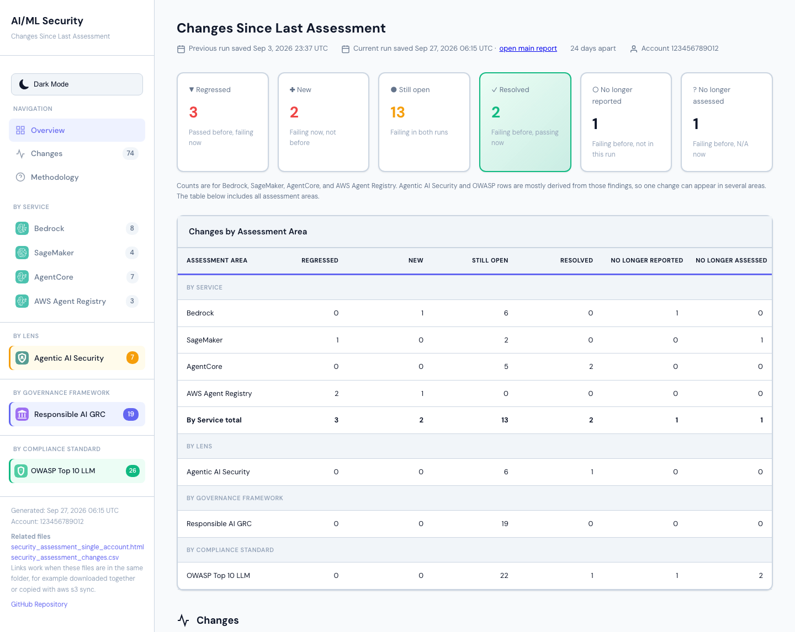

# Changes Since Last Assessment

After each assessment run, the framework compares each account's results with
that account's previous run and writes a **"Changes since last assessment"**
report next to the run's main report. It shows which findings were resolved,
which are still open, which regressed, which are new, and which no longer
appear.

## Table of Contents

- [What you get](#what-you-get)
- [Turning it on or off](#turning-it-on-or-off)
- [When it runs](#when-it-runs)
- [Which run is "the previous run"](#which-run-is-the-previous-run)
- [What is compared](#what-is-compared)
- [Change states](#change-states)
- [How findings are matched between runs](#how-findings-are-matched-between-runs)
- [Reading the report](#reading-the-report)
- [The changes CSV](#the-changes-csv)
- [Build log messages](#build-log-messages)
- [Re-runs, redeployments, and moved files](#re-runs-redeployments-and-moved-files)
- [Comparing two runs yourself](#comparing-two-runs-yourself)
- [Known limits](#known-limits)
- [For developers](#for-developers)

## What you get

For every account whose run completed, in the same folder as that run's main
report (`<AssessmentBucket>/<account_id>/`):

| File | What it is |
| --- | --- |
| `security_assessment_changes_<YYYYMMDD_HHMMSS>.html` | Interactive page: summary counts, counts by assessment area, and a filterable table of findings by change |
| `security_assessment_changes_<YYYYMMDD_HHMMSS>.csv` | The same results, one row per finding, with both runs' details, statuses, and severities |

The timestamp is when the **current run's** results were saved, in UTC, so
the name identifies the run it describes. Running the comparison again for the
same two runs overwrites the file instead of adding another.

In single-account mode the build also writes a small run record,
`assessment_history_run_<execution_id>.json`, after every run. It says
whether the run's Step Functions execution succeeded; see
[Which run is "the previous run"](#which-run-is-the-previous-run).

The first run of an account has nothing to compare with, so no changes report
is written for it. Every later run gets one, including runs where nothing
changed ("No changes since the last assessment").

A sample page and CSV are in [`sample-reports/`](../sample-reports/)
(`security_assessment_changes.html` and `.csv`), built from the
single-account sample report. Resource IDs and the random parts of resource
names in them are made-up values of the same shape, so they don't match the
sample main report.



## Turning it on or off

The report is controlled by the `EnableAssessmentHistory` deployment
parameter in both `deployment/aiml-security-single-account.yaml` and
`deployment/2-aiml-security-codebuild.yaml`:

| Value | Effect |
| --- | --- |
| `true` (default) | A changes report is written after each run |
| `false` | The comparison is skipped; the build log says `Changes report disabled (EnableAssessmentHistory=false)` |

The parameter reaches the build as the `ENABLE_ASSESSMENT_HISTORY`
CodeBuild environment variable. Stacks created before the parameter existed
don't have the variable, and are treated as `true`. A change takes effect on
the next build.

Findings CSVs are saved every run whatever the setting, so after turning the
report back on, the next run compares with the most recent usable run,
including runs made while it was off. Run records are written only while the
setting is on, so runs made while it was off are judged by their files alone.

## When it runs

The comparison runs in the CodeBuild post-build phase (`buildspec.yml`),
after the run's results are in the central `AssessmentBucket`:

- **Single-account:** after the results are synced to the central bucket,
  and only if the Step Functions execution succeeded. The run record is
  written first, whether the execution succeeded or not.
- **Multi-account:** once per account, after the multi-account report step
  (which is skipped when any account failed) and before the build's failure
  summary. Accounts whose run failed
  get no changes report; the build log names them and gives the reasons from
  the build's failure list.

It can't fail an assessment run:

- Any problem is printed as a `WARNING` line and the build carries on.
- Each account is handled on its own, so one account's problem doesn't stop
  the others.
- The step has a time limit of one minute per account, and at least 5
  minutes, but never more than the build time left. It's skipped when less
  than 6 minutes of build time are left. Accounts not started before the
  limit get a `WARNING` line, and a summary line counts them.
- In multi-account builds the accounts are started in an order that moves
  along one account with each CodeBuild build number, so if the limit is
  reached, it isn't always the same accounts that miss out.
- The CSV is written before the page, so if the page can't be written, the
  CSV is still there.

It reads only the findings CSVs already in the bucket and, in single-account
mode, the run records. It does not modify the scanners, the AWS SAM templates,
the Step Functions workflow, or the IAM roles.

## Which run is "the previous run"

Runs are told apart by the Step Functions execution ID in each findings CSV's
name. Execution IDs are random, so runs are ordered by **when S3 saved their
files**; a run's time is its latest file's time.

The previous run is the most recent **usable** run saved before the current
run. A run is usable when:

- **Its files are complete.** Every core service the run selected (Amazon
  Bedrock, Amazon SageMaker AI, Amazon Bedrock AgentCore, AWS Agent Registry),
  and OWASP if it ran, has a CSV with at least one row for every region the
  run's CSV names show (its core CSVs, or its OWASP CSVs when no core service
  was selected), and the Responsible AI GRC CSV, if present, has at least one
  row. This follows the main report's own completeness check, but from the files alone: the main report
  knows which regions the run was asked to scan and which options were on,
  and the files don't. So a run that failed partway can still look complete.
- **Its run record, if it has one, says it succeeded.** In single-account
  mode the build writes `assessment_history_run_<execution_id>.json` after
  every run. A Step Functions execution only succeeds when the main report's
  completeness check passes, so a run recorded as failed is never used. Runs
  with no record (made before this was added, or while the setting was off)
  are judged by their files alone. In multi-account mode the build uploads a
  run's files only after checking them, so no records are written.

- Runs that aren't usable are skipped and named in the build log, with the
  reason.
- An older run with a CSV that can't be read is skipped the same way, and the
  next older run is tried. A current run with a CSV that can't be read gets no
  report.
- Runs saved after the current run (for example, from another build running
  at the same time) are ignored and noted in the log.
- Two runs saved in the same second are ordered by execution ID, so the choice
  is always the same.
- Besides the current run and the chosen previous run, only runs passed over
  between them may be read; runs older than the chosen previous run never are.

**Service selection.** A service turned off with the deployment's
`Enable*Assessment` switches writes no CSV, so its CSVs aren't required. Which
services a run selected comes from:

- the current run: the build's `ENABLE_BEDROCK`, `ENABLE_SAGEMAKER`,
  `ENABLE_AGENTCORE`, and `ENABLE_AGENT_REGISTRY` settings (a missing setting
  means selected);
- an earlier single-account run: its run record, which lists the selected
  services;
- any other earlier run (multi-account runs, and single-account runs whose
  record doesn't list the selection): the services it has CSVs for. In
  multi-account mode the build uploads an account's files only after finding a
  CSV for each selected service, so a service with no CSV there wasn't
  selected.

A selected service with no CSV still makes a run incomplete. A run with all
four services off (Responsible AI GRC and OWASP only) is usable.

Runs made before release 2.0.0 have no AWS Agent Registry CSV and no run
record, so they are judged by their files: AWS Agent Registry counts as not
selected in that run and isn't compared, and checks added in 2.0.0 are listed
as found in only one run.

## What is compared

Only what ran in both runs is compared:

- **Core services** (Amazon Bedrock, Amazon SageMaker AI, Amazon Bedrock
  AgentCore, AWS Agent Registry) are compared only if both runs selected them. Otherwise the report's notes say "Not
  compared (not selected in both runs)", and the service's sidebar count and
  row in the counts by area say so instead of showing zero; the headline
  counts leave it out and the note under them names it.
- **Optional modules** (Responsible AI GRC, OWASP) are compared only if both
  runs have them. Otherwise the report says "Not compared (enabled in only
  one run)".
- **Regions** are compared only if both runs scanned them (taken from the core
  CSV names, or the OWASP CSV names when a run has no core CSV). Otherwise the
  report says "Not compared (scanned in only one run)". `Global` rows (account-level findings) are always compared. A row
  whose Region lists several regions is compared when every listed region was
  scanned in both runs.

Check IDs that appear in only one run (for example, after upgrading the
framework) are listed in the report as a note.

## Change states

| Previous run | Current run | Change |
| --- | --- | --- |
| Failed | Passed | **Resolved** |
| Failed | Failed | **Still open** |
| Passed | Failed | **Regressed** |
| Not present, or N/A | Failed | **New** |
| Failed | Not present | **No longer reported** |
| Failed | N/A | **No longer assessed** |

All other combinations have no `Failed` result in either run (for example,
Passed → Passed or Passed → N/A) and are shown as **Not failing**.

`Failed → N/A` is not counted as resolved, because `N/A` also covers
access-denied and unavailable-region results.

## How findings are matched between runs

Rows are grouped by assessment area, Region, and `Check_ID`. The `Finding`
title isn't part of the group: many checks use one title when they fail and
another when they pass or can't be assessed (for example, SM-04 writes
"GuardDuty Not Enabled", "GuardDuty Enabled", or "GuardDuty Check Error").
Some checks write one row per resource (for example, one row per IAM role),
with the resource only in `Finding_Details`. Within a group, rows are paired
in five steps: same title and details, same details with a new title, one row
each, several rows against one summary row, and everything else left unpaired.

<details>
<summary>The five matching steps in detail</summary>

1. **Same title, identical details.** Rows with the same `Finding` and
   `Finding_Details` are paired. Then rows with the same `Finding` are paired
   if their details match once values that change on every run are blanked
   out:

   | Changing value | Written by |
   | --- | --- |
   | `(N days)` | AC-03 (and AG-17, mapped from it), AR-02 |
   | `N days ago` | FS-31 (and OW-09, mapped from it) |
   | `on YYYY-MM-DD`, `since YYYY-MM-DD` | BR-14, SM-02 |

   Only these values are blanked. Digits in general are not, because
   resource names contain digits. A test fails if a scanner starts writing
   another day count or date into `Finding_Details` without it being added
   to this list.
2. **Same details, new title.** Rows whose details match, blanked the same
   way, are paired even if the title changed (for example, a title renamed in
   a new release).
3. **One row each.** Two remaining rows are paired even if their title and
   details differ, if each is its run's only row in the group, or its run's
   only row with that title. If both are Failed and their details differ, the
   row shows as Still open and is marked "details changed" (see
   [Known limits](#known-limits)).
4. **Several rows and one summary row.** If one run has several Failed rows
   left and the other run's only row for the check isn't Failed (a Passed
   summary such as "All 3 models have network isolation enabled", or an N/A
   error row), each Failed row is paired with that row. Several Failed rows
   and a Passed summary show as Resolved; a Passed summary and several Failed
   rows show as Regressed.
5. **Everything else is unpaired**, and shows as New or No longer reported.

A pair is made only when it's unambiguous: if two rows would pair with the
same row in steps 1 and 2, none of them is paired. The CSV's `Match_Rule`
column records which step paired each row (`exact`, `normalized`, `details`,
`single-row`, `check-level`, or `unmatched`), so any result can be traced. A
`check-level` summary row appears once for each row it's paired with.

Repeated rows within a run are dropped first, with the same rule the main
report uses.

</details>

## Reading the report

The page uses the main report's layout, styling, and light/dark setting (the
choice carries over between the two reports).

- **Header:** both runs' save times (UTC), how many days apart they are
  (counted by calendar date), and the account. When the current run's main
  report can be identified with certainty, the header links to it.
- **Summary counts:** Regressed, New, Still open, Resolved, No longer
  reported, and No longer assessed, for the four core services only, or for
  those of them selected in both runs; the note under the counts names any
  service left out. With none of the four selected in both runs, the counts
  show "—". Most Agentic AI Security and OWASP rows are derived from service findings, so one change can appear in
  several areas; counts are shown per area and not added across areas.
- **Counts by area:** under the main report's headings (By Service, By Lens,
  By Governance Framework, By Compliance Standard).
- **Changes table:** the main report's columns, with **Change** in place of
  Status; under each change, the two runs' statuses (for example
  `Passed → Failed`). Filters for search, Region, Assessment Area, Severity,
  and Change. By default the table shows every change state and hides Not
  failing rows; choose **All Findings** in the Change filter to show them.
  A Still open row whose two Failed rows were paired only because each run had
  one, with different details, reads `Failed → Failed · details changed` and
  has a note under its details.
  Clicking an area in the sidebar filters the table to it.
- **Severity:** the current run's, except for No longer reported and No
  longer assessed rows, which show the previous run's (the current one is
  missing or just "Informational").
- **Details:** when a finding's details differ between the runs, both
  versions are shown, labeled "previous run" and "current run".

The sidebar lists the main report and the changes CSV by file name. The links
work when the files are in the same folder, for example downloaded together
or copied with `aws s3 sync`; opening the page straight from the S3 console
opens one file at a time. The main report has no link to a single finding:
use its search box, for example with the Check ID.

## The changes CSV

One row per compared finding, in these columns:

| Column | Contents |
| --- | --- |
| `Account_ID` | The account |
| `Assessment_Area` | `bedrock`, `sagemaker`, `agentcore`, `agent-registry`, `agentic`, `responsible-ai-grc`, or `owasp` |
| `Region`, `Check_ID`, `Finding` | As in the findings CSVs |
| `Change` | One of the change states above, including `Not failing` |
| `Previous_Status`, `Current_Status` | `Passed`, `Failed`, `N/A`, or `Not present` |
| `Previous_Severity`, `Current_Severity` | Each run's severity (blank when not present) |
| `Previous_Finding_Details`, `Current_Finding_Details` | Each run's details (blank when not present) |
| `Resolution`, `Reference` | From the current run, or the previous run when the finding is gone |
| `Match_Rule` | `exact`, `normalized`, `details`, `single-row`, `check-level`, or `unmatched` |
| `Previous_Execution_ID`, `Current_Execution_ID` | The two runs compared |

A cell that starts with `=`, `+`, `-`, `@`, a tab, or a carriage return gets
a leading `'` so spreadsheet programs don't run it as a formula; finding text
can contain resource names chosen by anyone who can create resources.

## Build log messages

Search the CodeBuild log for `Changes report` to find the comparison's
messages. If no changes report was written, the message says why.

<details>
<summary>All build log messages</summary>

| Message | Meaning |
| --- | --- |
| `Changes report for account <id>` | Start of that account's comparison |
| `Compared run <id> (saved <time>) with run <id> (saved <time>), N day(s) apart` | The two runs used |
| `<services>: Regressed N, New N, Still open N, Resolved N, No longer reported N, No longer assessed N` | The headline counts, for the core services selected in both runs |
| `No changes since the last assessment` | Nothing changed; the report is still written |
| `Written: s3://...` | Where the report was written |
| `No previous run for account <id>; changes report skipped. If this stack was redeployed, or earlier results were moved or deleted, they aren't compared. ...` | First run for the account, or no usable earlier run in the bucket |
| `Skipped run <id> saved <time>: incomplete (...)` | An incomplete run passed over |
| `Skipped run <id> saved <time>: the assessment run did not succeed (...)` | Its run record says the Step Functions execution didn't succeed |
| `Skipped run <id> saved <time>: its run record <file> can't be read` | The run record isn't valid, so the run isn't used |
| `Skipped run <id> saved <time>: unreadable (...)` | One of the run's CSVs can't be read; the next older run is tried |
| `Skipped N more run(s)` | More than five runs were passed over |
| `Not compared (not selected in both runs): <service> (<which run>)` | A core service selected in only one of the two runs, or in neither; it's left out of the comparison and the counts |
| `Not compared (enabled in only one run): <module> (<which run>)` | Responsible AI GRC or OWASP ran in only one of the two runs |
| `Not compared (scanned in only one run): <region> (<which run>)` | A region scanned in only one of the two runs |
| `Check IDs found in only one run: <id> (<which run>)` | For example, checks added or removed by an upgrade |
| `No core service was selected in both runs, so there are no headline counts; see the changes CSV` | Only Responsible AI GRC or OWASP were compared |
| `WARNING: ENABLE_<SERVICE>='<value>' is not true or false; the services with CSVs are taken as selected` | A service switch has an unexpected value |
| `WARNING: ENABLE_<SERVICE> is '<value>', not true or false, so the run record does not list the selected services` | Single-account: the record is still written; later runs judge this run by its files |
| `WARNING: Could not write the assessment run record s3://...` | Single-account: no record for this run; it will be judged by its files |
| `WARNING: No execution ID was saved, so no assessment run record was written` | Single-account: the run didn't start |
| `Ignored N run(s) saved after the current run: ...` | Runs newer than the current run |
| `Not read: <file> (unknown findings file type)` | A findings CSV from a module this version doesn't know |
| `WARNING: Changes report cannot be completed for account <id>. Reason(s): ...` | No report for that account; the reasons are listed |
| `WARNING: Changes report skipped: only Ns of build time left` | Too little build time left |
| `WARNING: The time limit was reached with N of M account(s) not started: ...` | The accounts that got no report this build; the next build starts with a different account |
| `Starting with account <id>: the account order moves along one account with each build number` | Multi-account: which account went first this build |
| `WARNING: The changes page for account <id> could not be written; the CSV was. Reason: ...` | Only the CSV was written for that account |
| `Changes report skipped: the assessment run did not succeed` | Single-account run failed |
| `Changes report disabled (EnableAssessmentHistory=false)` | The setting is off |
| `WARNING: ENABLE_ASSESSMENT_HISTORY is '<value>', not true or false; using true` | The setting has an unexpected value; the report is written |
| `WARNING: The changes report step did not complete; assessment results are not affected` | The step stopped early, for example at the time limit |

</details>

## Re-runs, redeployments, and moved files

- **Re-runs.** Every run is the same build; there is no separate "first run"
  setting. Start a run from CodeBuild (**Start build**) or on a schedule (see
  [Can I schedule automated assessments?](FAQ.md#can-i-schedule-automated-assessments)).
  Each run is compared with the most recent usable run before it.
- **Redeploying.** History lives in the infrastructure stack's
  `AssessmentBucket`. Updating the stack keeps it. Deleting and recreating the
  stack creates a new bucket, so history starts over. Switching between
  single-account and multi-account uses a different bucket, so the first run
  after switching has no previous run.
- **Moving, copying, or renaming files.** Don't move, copy, or rename files
  inside an account's results folder. To archive, copy them somewhere else
  and leave the originals. To restore a deleted file, use S3 versioning (it's
  on for the bucket). A file copied back into the folder gets a new save time,
  so an old run can look like the newest; the report header always shows both
  runs' dates, so a comparison with an unexpected run is visible.
- **Custom execution names.** Starting executions by hand with custom names
  isn't supported for history; the build always uses generated IDs.

## Comparing two runs yourself

You can run the same comparison on your computer for any two runs.

<details>
<summary>How to compare two runs locally</summary>

The same code compares any two runs on your computer. Copy each run's findings
CSVs into its own folder (for example with `aws s3 cp --recursive --exclude "*"
--include "*_security_report_<execution_id>*"`), then run from the repository
root:

```bash
.venv/bin/python -m assessment_history compare \
  --account 123456789012 \
  --previous-dir ./previous-run \
  --current-dir ./current-run \
  --output-dir ./changes
```

Each folder must hold one complete run. The `EnableAssessmentHistory` setting
is ignored in this mode.

</details>

## Known limits

- When a check writes one row per resource and each run has exactly one
  Failed row, those rows are paired even if they name different resources.
  For example, fixing notebook A while notebook B starts failing shows as one
  Still open row, not Resolved plus New. The row is marked "details changed"
  so it can be checked; both runs' details are shown. Some checks write one
  summary row for many resources (for example a count of roles); a change
  inside that row shows the same way. Telling the two kinds of check apart
  would need a list of every check's row format, which is planned as a
  follow-up.
- A check that lists several resources in one row (for example, AC-03 lists
  every stale role) shows as No longer reported plus New when the list
  changes, because the rows can't be paired with certainty.
- OWASP rows are compared as one module. When a service is selected in one
  run and not the other, the OWASP rows built from that service's findings
  are still compared, so they can show as No longer reported, No longer
  assessed, or New. The service's own rows are left out.
- The comparison is always with the most recent usable run. Month, quarter,
  and year views are planned as a follow-up.
- Runs are ordered by save time, so files copied back into a results folder
  can change which run is picked (see above).

## For developers

The package layout, tests, coverage bar, and golden sample workflow are
described in the Developer Guide under
[Assessment History (Changes Since Last Assessment)](DEVELOPER_GUIDE.md#assessment-history-changes-since-last-assessment).
